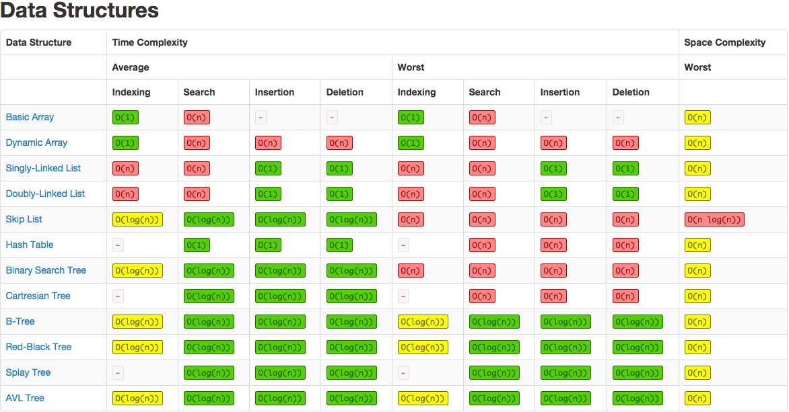
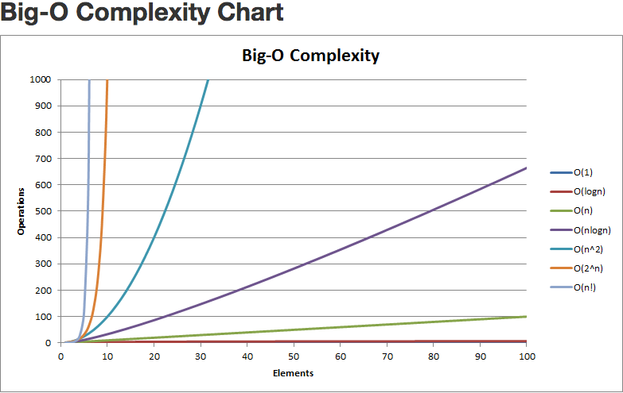
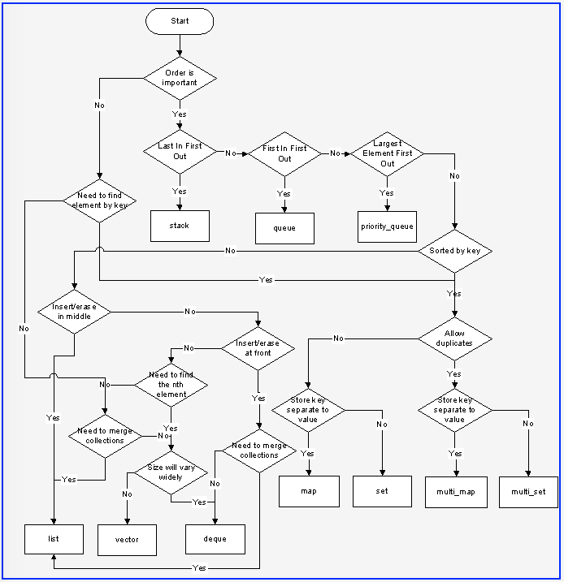
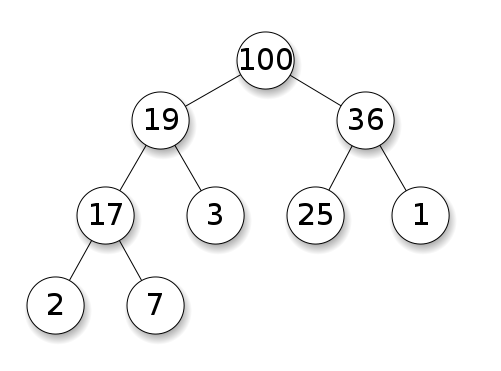
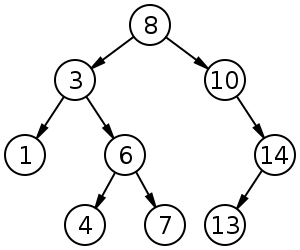
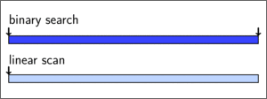
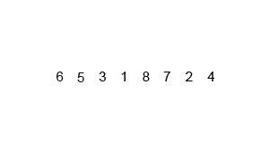

# C++ Syntax, Data Structures, and Algorithms Cheat Sheet

## Table of Contents

<!-- TOC depthFrom:1 depthTo:6 withLinks:1 updateOnSave:1 orderedList:0 -->

- [C++ Syntax, Data Structures, and Algorithms Cheat Sheet](#c-syntax-data-structures-and-algorithms-cheat-sheet)
	- [Table of Contents](#table-of-contents)
	- [1.0 Data Structures](#10-data-structures)
		- [1.1 Overview](#11-overview)
		- [1.2 Vector `std::vector`](#12-vector-stdvector)
		- [1.3 Deque `std::deque`](#13-deque-stddeque)
		- [1.4 List `std::list` and `std::forward_list`](#14-list-stdlist-and-stdforwardlist)
		- [1.5 Map `std::map` and `std::unordered_map`](#15-map-stdmap-and-stdunorderedmap)
		- [1.6 Set `std::set`](#16-set-stdset)
		- [1.7 Stack `std::stack`](#17-stack-stdstack)
		- [1.8 Queue `std::queue`](#18-queue-stdqueue)
		- [1.9 Priority Queue `std::priority_queue`](#19-priority-queue-stdpriorityqueue)
		- [1.10 Heap `std::priority_queue`](#110-heap-stdpriorityqueue)
	- [2.0 Trees](#20-trees)
		- [2.1 Binary Tree](#21-binary-tree)
		- [2.2 Balanced Trees](#22-balanced-trees)
		- [2.3 Binary Search](#23-binary-search)
		- [2.4 Depth-First Search](#24-depth-first-search)
		- [2.5 Breadth-First Search](#25-breadth-first-search)
	- [3.0 NP Complete Problems](#30-np-complete-problems)
		- [3.1 NP Complete](#31-np-complete)
		- [3.2 Traveling Salesman Problem](#32-traveling-salesman-problem)
		- [3.3 Knapsack Problem](#33-knapsack-problem)
	- [4.0 Algorithms](#40-algorithms)
		- [4.1 Insertion Sort](#41-insertion-sort)
		- [4.2 Selection Sort](#42-selection-sort)
		- [4.3 Bubble Sort](#43-bubble-sort)
		- [4.4 Merge Sort](#44-merge-sort)
		- [4.5 Quicksort](#45-quicksort)
	- [5.0 C++ Classes](#50-c-classes)
		- [5.1 Class Syntax](#51-class-syntax)
			- [5.1.1 Class Declaration (`.h` file)](#511-class-declaration-h-file)
			- [5.1.2 Class Definition (`.cpp` file)](#512-class-definition-cpp-file)
- [include "Polygon.h"    //<--- Obtains the class declaration](#include-polygonh-obtains-the-class-declaration)
			- [5.1.3 Class Utilization (Another `.cpp` file)](#513-class-utilization-another-cpp-file)
- [include "Polygon.h"    //<--- Obtains the class declaration](#include-polygonh-obtains-the-class-declaration)
		- [5.2 Inheritance](#52-inheritance)
		- [5.3 Polymorphism](#53-polymorphism)
		- [5.4 Templates](#54-templates)
		- [5.5 Constructor/Destructor/Copy Constructor](#55-constructordestructorcopy-constructor)
		- [5.6 Operator Overloading](#56-operator-overloading)
	- [6.0 General C++ Syntax](#60-general-c-syntax)
		- [6.1 References/Pointers](#61-referencespointers)
		- [6.2 Use of `const`](#62-use-of-const)
		- [6.3 Strings (find, erase, etc)](#63-strings-find-erase-etc)
		- [6.4 Iterators](#64-iterators)
		- [6.5 Exceptions](#65-exceptions)

<!-- /TOC -->


## 1.0 Data Structures
### 1.1 Overview







-------------------------------------------------------
### 1.2 Vector `std::vector`
**Use for**
* Simple storage
* Adding but not deleting
* Serialization
* Quick lookups by index
* Easy conversion to C-style arrays
* Efficient traversal (contiguous CPU caching)

**Do not use for**
* Insertion/deletion in the middle of the list
* Dynamically changing storage
* Non-integer indexing

**Time Complexity**

| Operation    | Time Complexity |
|--------------|-----------------|
| Insert Head  |          `O(n)` |
| Insert Index |          `O(n)` |
| Insert Tail  |          `O(1)` |
| Remove Head  |          `O(n)` |
| Remove Index |          `O(n)` |
| Remove Tail  |          `O(1)` |
| Find Index   |          `O(1)` |
| Find Object  |          `O(n)` |

**Example Code**
```c++
std::vector<int> v;

//---------------------------------
// General Operations
//---------------------------------

//Insert head, index, tail
v.insert(v.begin(), value);             //head
v.insert(v.begin() + index, value);     //index
v.push_back(value);                     //tail

//Access head, index, tail
int head = v.front();       //head
int value = v.at(index);    //index
int tail = v.back();        //tail

//Size
unsigned int size = v.size();

//Iterate
for(std::vector<int>::iterator it = v.begin(); it != v.end(); it++) {
    std::cout << *it << std::endl;
}

//Remove head, index, tail
v.erase(v.begin());             //head
v.erase(v.begin() + index);     //index
v.pop_back();                   //tail

//Clear
v.clear();
```
-------------------------------------------------------
### 1.3 Deque `std::deque`
**Use for**
* Similar purpose of `std::vector`
* Basically `std::vector` with efficient `push_front` and `pop_front`

**Do not use for**
* C-style contiguous storage (not guaranteed)

**Notes**
* Pronounced 'deck'
* Stands for **D**ouble **E**nded **Que**ue

**Example Code**
```c++
std::deque<int> d;

//---------------------------------
// General Operations
//---------------------------------

//Insert head, index, tail
d.push_front(value);                    //head
d.insert(d.begin() + index, value);     //index
d.push_back(value);                     //tail

//Access head, index, tail
int head = d.front();       //head
int value = d.at(index);    //index
int tail = d.back();        //tail

//Size
unsigned int size = d.size();

//Iterate
for(std::vector<int>::iterator it = d.begin(); it != d.end(); it++) {
    std::cout << *it << std::endl;
}

//Remove head, index, tail
d.pop_front();                  //head
d.erase(d.begin() + index);     //index
d.pop_back();                   //tail

//Clear
d.clear();
```
-------------------------------------------------------
### 1.4 List `std::list` and `std::forward_list`
**Use for**
* Insertion into the middle/beginning of the list
* Efficient sorting (pointer swap vs. copying)

**Do not use for**
* Direct access

**Time Complexity**

| Operation    | Time Complexity |
|--------------|-----------------|
| Insert Head  |          `O(1)` |
| Insert Index |          `O(n)` |
| Insert Tail  |          `O(1)` |
| Remove Head  |          `O(1)` |
| Remove Index |          `O(n)` |
| Remove Tail  |          `O(1)` |
| Find Index   |          `O(n)` |
| Find Object  |          `O(n)` |

**Example Code**
```c++
std::list<int> l;

//---------------------------------
// General Operations
//---------------------------------

//Insert head, index, tail
l.push_front(value);                    //head
l.insert(l.begin() + index, value);     //index
l.push_back(value);                     //tail

//Access head, index, tail
int head = l.front();                                           //head
int value = std::list<int>::iterator it = l.begin() + index;    //index
int tail = l.back();                                            //tail

//Size
unsigned int size = l.size();

//Iterate
for(std::list<int>::iterator it = l.begin(); it != l.end(); it++) {
    std::cout << *it << std::endl;
}

//Remove head, index, tail
l.pop_front();                  //head
l.erase(l.begin() + index);     //index
l.pop_back();                   //tail

//Clear
l.clear();

//---------------------------------
// Container-Specific Operations
//---------------------------------

//Splice: Transfer elements from list to list
//  splice(iterator pos, list &x)
//  splice(iterator pos, list &x, iterator i)
//  splice(iterator pos, list &x, iterator first, iterator last)
l.splice(l.begin() + index, list2);

//Remove: Remove an element by value
l.remove(value);

//Unique: Remove duplicates
l.unique();

//Merge: Merge two sorted lists
l.merge(list2);

//Sort: Sort the list
l.sort();

//Reverse: Reverse the list order
l.reverse();
```
-------------------------------------------------------
### 1.5 Map `std::map` and `std::unordered_map`
**Use for**
* Key-value pairs
* Constant lookups by key
* Searching if key/value exists
* Removing duplicates
* `std::map`
    * Ordered map
* `std::unordered_map`
    * Hash table

**Do not use for**
* Sorting

**Notes**
* Typically ordered maps (`std::map`) are slower than unordered maps (`std::unordered_map`)
* Maps are typically implemented as *binary search trees*

**Time Complexity**

**`std::map`**

| Operation           | Time Complexity |
|---------------------|-----------------|
| Insert              |     `O(log(n))` |
| Access by Key       |     `O(log(n))` |
| Remove by Key       |     `O(log(n))` |
| Find/Remove Value   |     `O(log(n))` |

**`std::unordered_map`**

| Operation           | Time Complexity |
|---------------------|-----------------|
| Insert              |          `O(1)` |
| Access by Key       |          `O(1)` |
| Remove by Key       |          `O(1)` |
| Find/Remove Value   |              -- |

**Example Code**
```c++
std::map<std::string, std::string> m;

//---------------------------------
// General Operations
//---------------------------------

//Insert
m.insert(std::pair<std::string, std::string>("key", "value"));

//Access key, value
std::string value = m.at("key");
std::string value = *(std::map<std::string, std::string>::iterator it = m.find("value"));

//Size
unsigned int size = m.size();

//Iterate
for(std::map<int>::iterator it = m.begin(); it != m.end(); it++) {
    std::cout << "key"*it << std::endl;
}

//Remove by key, value
m.erase("key");
m.erase(m.find("value"));

//Clear
m.clear();

//---------------------------------
// Container-Specific Operations
//---------------------------------

//Find if an element exists by value
bool exists = (m.find("value") != m.end());

//Count the number of elements with a certain key
unsigned int count = m.count("key");
```
-------------------------------------------------------
### 1.6 Set `std::set`
**Use for**
* Removing duplicates
* Ordered dynamic storage

**Do not use for**
* Simple storage
* Direct access by index

**Notes**
* Sets are often implemented with binary search trees

**Time Complexity**

| Operation    | Time Complexity |
|--------------|-----------------|
| Insert       |     `O(log(n))` |
| Remove       |     `O(log(n))` |
| Find         |     `O(log(n))` |

**Example Code**
```c++
std::set<int> s;

//---------------------------------
// General Operations
//---------------------------------

//Insert
s.insert(20);

//Size
unsigned int size = s.size();

//Iterate
for(std::set<int>::iterator it = s.begin(); it != s.end(); it++) {
    std::cout << *it << std::endl;
}

//Remove
s.remove(20);

//Clear
s.clear();

//---------------------------------
// Container-Specific Operations
//---------------------------------

//Find if an element exists
bool exists = (s.find(20) != s.end());

//Count the number of elements with a certain value
unsigned int count = s.count(20);
```
-------------------------------------------------------
### 1.7 Stack `std::stack`
**Use for**
* First-In Last-Out operations
* Reversal of elements

**Time Complexity**

| Operation    | Time Complexity |
|--------------|-----------------|
| Push         |          `O(1)` |
| Pop          |          `O(1)` |
| Top          |          `O(1)` |

**Example Code**
```c++
std::stack<int> s;

//---------------------------------
// Container-Specific Operations
//---------------------------------

//Push
s.push(20);

//Size
unsigned int size = s.size();

//Pop
s.pop();

//Top
int top = s.top();
```
-------------------------------------------------------
### 1.8 Queue `std::queue`
**Use for**
* First-In First-Out operations
* Ex: Simple online ordering system (first come first served)
* Ex: Semaphore queue handling
* Ex: CPU scheduling (FCFS)

**Notes**
* Often implemented as a `std::deque`

**Example Code**
```c++
std::queue<int> q;

//---------------------------------
// General Operations
//---------------------------------

//Insert
q.push(value);

//Access head, tail
int head = q.front();       //head
int tail = q.back();        //tail

//Size
unsigned int size = q.size();

//Remove
q.pop();
```
-------------------------------------------------------
### 1.9 Priority Queue `std::priority_queue`
**Use for**
* First-In First-Out operations where **priority** overrides arrival time
* Ex: CPU scheduling (smallest job first, system/user priority)
* Ex: Medical emergencies (gunshot wound vs. broken arm)

**Notes**
* Often implemented as a `std::vector`

**Example Code**
```c++
std::priority_queue<int> p;

//---------------------------------
// General Operations
//---------------------------------

//Insert
p.push(value);

//Access
int top = p.top();  //`Top` element

//Size
unsigned int size = p.size();

//Remove
p.pop();
```
-------------------------------------------------------
### 1.10 Heap `std::priority_queue`
**Notes**
* A heap is essentially an instance of a priority queue
* A **min** heap is structured with the root node as the smallest and each child subsequently smaller than its parent
* A **max** heap is structured with the root node as the largest and each child subsequently larger than its parent
* A min heap could be used for *Smallest Job First* CPU Scheduling
* A max heap could be used for *Priority* CPU Scheduling

**Max Heap Example (using a binary tree)**


-------------------------------------------------------
## 2.0 Trees
### 2.1 Binary Tree
* A binary tree is a tree with at most two (2) child nodes per parent
* Binary trees are commonly used for implementing `O(log(n))` operations for ordered maps, sets, heaps, and binary search trees
* Binary trees are **sorted** in that nodes with values greater than their parents are inserted to the **right**, while nodes with values less than their parents are inserted to the **left**

**Binary Search Tree**


-------------------------------------------------------
### 2.2 Balanced Trees
* Balanced trees are a special type of tree which maintains its balance to ensure `O(log(n))` operations
* When trees are not balanced the benefit of `log(n)` operations is lost due to the highly vertical structure
* Examples of balanced trees:
    * AVL Trees
    * Red-Black Trees

-------------------------------------------------------
### 2.3 Binary Search
**Idea:**
1. If current element, return
2. If less than current element, look left
3. If more than current element, look right
4. Repeat

**Data Structures:**
* Tree
* Sorted array

**Space:**
* `O(1)`

**Best Case:**
* `O(1)`

**Worst Case:**
* `O(log n)`

**Average:**
* `O(log n)`

**Visualization:**


-------------------------------------------------------
### 2.4 Depth-First Search
**Idea:**
1. Start at root node
2. Recursively search all adjacent nodes and mark them as searched
3. Repeat

**Data Structures:**
* Tree
* Graph

**Space:**
* `O(V)`, `V = number of verticies`

**Performance:**
* `O(E)`, `E = number of edges`

**Visualization:**


-------------------------------------------------------
### 2.5 Breadth-First Search
**Idea:**
1. Start at root node
2. Search neighboring nodes first before moving on to next level

**Data Structures:**
* Tree
* Graph

**Space:**
* `O(V)`, `V = number of verticies`

**Performance:**
* `O(E)`, `E = number of edges`

**Visualization:**


-------------------------------------------------------
## 3.0 NP Complete Problems
### 3.1 NP Complete
* **NP Complete** means that a problem is unable to be solved in **polynomial time**
* NP Complete problems can be *verified* in polynomial time, but not *solved*

-------------------------------------------------------
### 3.2 Traveling Salesman Problem

-------------------------------------------------------
### 3.3 Knapsack Problem

-------------------------------------------------------

## 4.0 Algorithms
###  4.1 Insertion Sort
**Idea:**
1. Iterate over all elements
2. For each element:
    * Check if element is larger than largest value in sorted array
3. If larger: Move on
4. If smaller: Move item to correct position in sorted array

**Data structure:**
* Array

**Space:**
* O(1)

**Best Case:**
    * Already sorted
    * O(n)
**Worst Case:**
    * Reverse sorted
    * O(n^2)
**Average:**
    * O(n^2)

**Advantages**
    * Easy to code
    * Intuitive
    * Better than selection sort and bubble sort for small data sets
    * Can sort in-place

**Disadvantages**
    * Very inefficient for large datasets

**Visualization**


-------------------------------------------------------
### 4.2 Selection Sort
**Idea:**
1. Iterate over all elements
2. For each element:
    * If smallest element of unsorted sublist, swap with left-most unsorted element

**Data structure:**
* Array

**Space:**
* O(1)

**Best Case:**
    * Already sorted
    * O(n^2)
**Worst Case:**
    * Reverse sorted
    * O(n^2)
**Average:**
    * O(n^2)

**Advantages**
    * Simple
    * Can sort in-place
    * Low memory usage for small datasets

**Disadvantages**
    * Very inefficient for large datasets

**Visualization**


-------------------------------------------------------
### 4.3 Bubble Sort
**Idea:**
1. Iterate over all elements
2. For each element:
    * Swap with next element if out of order
3. Repeat until no swaps needed

**Data structure:**
* Array

**Space:**
* O(1)

**Best Case:**
    * Already sorted
    * O(n)
**Worst Case:**
    * Reverse sorted
    * O(n^2)
**Average:**
    * O(n^2)

**Advantages**
    * Easy to detect if list is sorted

**Disadvantages**
    * Very inefficient for large datasets
    * Much worse than even insertion sort

**Visualization**


-------------------------------------------------------
### 4.4 Merge Sort
**Idea:**
1. Divide list into smallest unit (1 element)
2. Compare each element with the adjacent list
3. Merge the two adjacent lists
4. Repeat

**Data structure:**
* Array

**Space:**
* O(n) auxiliary

**Best Case:**
    * O(nlog(n))
**Worst Case:**
    * Reverse sorted
    * O(nlog(n))
**Average:**
    * O(nlog(n))

**Advantages**
    * High efficiency on large datasets
    * Nearly always O(nlog(n))
    * Can be parallelized
    * Better space complexity than standard Quicksort

**Disadvantages**
    * Still requires O(n) extra space
    * Slightly worse than Quicksort in some instances

**Visualization**



-------------------------------------------------------
### 4.5 Quicksort
**Idea:**
1. Choose a **pivot** from the array
2. Partition: Reorder the array so that all elements with values *less* than the pivot come before the pivot, and all values *greater* than the pivot come after
3. Recursively apply the above steps to the sub-arrays

**Data structure:**
* Array

**Space:**
* O(n)

**Best Case:**
    * O(nlog(n))
**Worst Case:**
    * All elements equal
    * O(n^2)
**Average:**
    * O(nlog(n))

**Advantages**
    * Can be modified to use O(log(n)) space
    * Very quick and efficient with large datasets
    * Can be parallelized
    * Divide and conquer algorithm

**Disadvantages**
    * Not stable (could swap equal elements)
    * Worst case is worse than Merge Sort

**Optimizations**
* Choice of pivot:
    * Choose median of the first, middle, and last elements as pivot
    * Counters worst-case complexity for already-sorted and reverse-sorted

**Visualization**


-------------------------------------------------------

## 5.0 C++ Classes
### 5.1 Class Syntax
#### 5.1.1 Class Declaration (`.h` file)
Here's a simple class representing a polygon, a shape with any number of sides.

The class *declaration* typically goes in the `.h` file. The *declaration* gives the class name, any classes it may extend, declares the members and methods, and declares which members/methods are public, private, or protected.
```c++
class Polygon {

//Private members and methods are only accessible via methods in the class definition
//Another option is 'protected', which are members and methods only accessible in the class definition or by classes who extend this class
private:
    int sides;          //Number of sides
    std::string name    //Name of the polygon

//Public members and methods are accessible to anyone who creates an instance of the class
public:
    //Constructors
    Polygon(const int sides, const std::string &name);  //<--- This constructor takes the number of sides and name as arguments

    //Getters and Setters
    const int GetSides(void) const;
    void SetSides(const int sides);

    const std::string & GetName(void) const;
    void SetName(const std::string &name);

    Test() : int_data(0), str_data("empty"), num_data(10.6) {}

}; //<--- Don't forget the semicolon!
```

#### 5.1.2 Class Definition (`.cpp` file)
```c++
#include "Polygon.h"    //<--- Obtains the class declaration

//Constructor
//You must scope the method definitions with the class name (Polygon::)
Polygon::Polygon(const int sides, const std::string &name) {
    this->sides = sides;    //'this' refers to the instance of the class. Members are accessed via pointers
    this->name = name;
}

//Get the number of sides
const int Polygon::GetSides(void) const {
    return this->sides;
}

//Set the number of sides
void Polygon::SetSides(const int sides) {
    this->sides = sides;
}

//Get the polygon name
const std::string & Polygon::GetName(void) const {
    return this->name;
}

//Set the polygon name
void Polygon::SetName(const std::string &name) {
    this->name = name;
}
```

#### 5.1.3 Class Utilization (Another `.cpp` file)
```c++
#include <string>
#include "Polygon.h"    //<--- Obtains the class declaration

int main(int argc, char *argv[]) {
    //Create a polygon with 4 sides and name "Rectangle"
    Polygon polygon = Polygon(4, "Rectangle");

    //Check number of sides -- Prints "Rectangle has 4 sides"
    std::cout << polygon.name << " has " << polygon.GetSides() << " sides"<< std::endl;

    //Change number of sides to 3 and name to "Triangle"
    polygon.SetSides(3);
    polygon.SetName("Triangle");
}
```

#### 5.1.4 Getters and Setters
A shortcut often used for Getters/Setters is to define them in the class declaration (`.h`) file as follows:
```c++
class Car {
	int year;
	std::string make;
public:
	const int GetYear(void) const { return this->year; }
	void SetYear(const int year) { this->year = year; }
	const std::string & GetMake(void) const { return this->make; }
	void SetMake(const std::string &make) { this->make = make; }
};
```

Another important consideration: If you have getters and setters for all of your members, you may want to reconsider the design of your class. It is more often than not that having getters and setters for every member is indicative of poor planning of the class design and interface. Getters are very common, but setters should be used more carefully. Should you have set the variable in the constructor? Is it set somewhere else in another method, perhaps even indirectly?

### 5.2 Inheritance
A class can extend another class, meaning that the new class inherits all of the data from the other class, and can also override its methods, add new members, etc. Inheritance is the key feature required for polymorphism.

**Example:** the class `Rectangle` can inherit the class `Polygon`. You would then say that `Rectangle` extends `Polygon`, or that class `Rectangle` is a sub-class of `Polygon`. In plain English, this means that a `Rectangle` is a more specialized version of a `Polygon`.

#### 5.2.1 `Rectangle` Declaration (`.h` file)
```c++
#include "Polygon.h"	//<--- You must include the declaration in order to extend the class

class Rectangle: public Polygon {	//<--- This
private:			//<--- The members 'sides' and 'name' are already inherited from Polygon
	int length;
	int width;

public:
	//Constructors
	Rectangle(const std::string &name);
	Rectangle(const std::string &name, const int length, const int width);

	//Getters and Setters	<--- The methods 'GetSides()', 'SetSides()', 'GetName()' and 'SetName()' are already inherited from Polygon
	const int GetLength(void) const { return this->length; }
	void SetLength(const int) { this->length = length; }

	const int GetWidth(void) const { return this->width; }
	void SetWidth(const int) { this->width = width; }

	//Other Methods
	const int Area(void) const;
};
```

#### 5.2.2 `Rectangle` Definition (`.cpp` file)
```c++
#include "Rectangle.h"	//<--- Only need to include 'Rectangle', since 'Polygon' is included in 'Rectangle.h'

//This constructor calls the superclass (Polygon) constructor and sets the name and number of sides to '4'
Rectangle::Rectangle(const std::string &name) : Polygon(4, name) {
	this->length = 0;
	this->width = 0;
}

//Area
Rectangle::Area(void) const {
	return (this->length * this->width);
}
```

#### 5.2.3 `Rectangle` Utilization (Another `.cpp` file)
```c++
#include "Rectangle.h"

int main(int argc, char *argv[]) {
	Rectangle rectangle = Rectangle("Square", 6, 6);

	//Prints "Square has 4 sides, and an area of 36"
	std::cout << rectangle.GetName() << " has " << rectangle.GetSides() << " sides, and an area of " << rectangle.Area() << std::endl;
}
```

### 5.3 Polymorphism
### 5.4 Templates
### 5.5 Constructor/Destructor/Copy Constructor
#### 5.5.1 Use of `explicit` in Constructors
The keyword `explicit` should be used in single-argument constructors to avoid the following situation. Consider the class `Array`:
```c++
class Array {
public:
	Array(int size) {
		this->size = size;
	}

private:
	int size;
}
```

The following is now legal but ambiguous:
```c++
Array array = 12345;
```

It ends up being the equivalent of this:
```c++
Array array = Array(12345);
```

That's fine, one would suppose, but what about the following:
```c++
//Method PrintArray is defined as: Array::Print(const Array &array)
array.Print(12345);
```

Uh-oh. That's now legal, compilable code, but what does it mean? It is extremely unclear to the user.

To fix this, declare the single-argument `Array` constructor as `explicit`:
```c++
class Array {
public:
	explicit Array(int size) {
		this->size = size;
	}
}
```

Now you can only use the print method as follows:
```c++
array.Print(Array(12345));
```

### 5.5 Initialization Lists
### 5.7 Operator Overloading

## 6.0 General C++ Syntax
### 6.1 Namespaces
### 6.2 References/Pointers
### 6.3 Use of `const`
### 6.4 Strings (find, erase, etc)
### 6.5 Iterators
### 6.6 Exceptions
